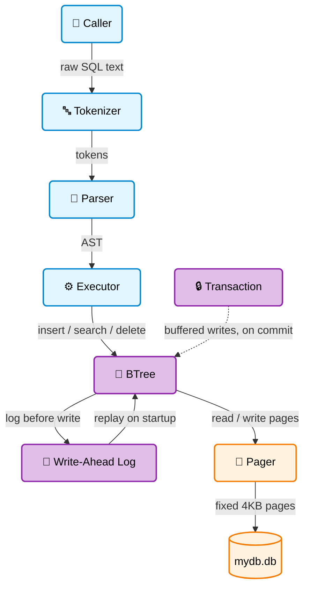

# ToyDB Engine

**A Database Engine Built From Scratch :- B-Tree Storage, Write-Ahead Logging, and a Hand-Written SQL Layer**

Author: Leelakrishna Rajasimha Yadav Doddakula

Date: September 2026

## Project Overview

This project implements a small but genuinely functional database engine in Python — not an ORM, not a wrapper around SQLite, but the actual storage layer: pages on disk, a B-tree, a write-ahead log, and a hand-written SQL parser sitting on top of it.

The goal was to understand what happens *underneath* every database call most engineers never look past — how a row becomes bytes on disk, how a crash mid-write doesn't have to mean corrupted data, and how `SELECT * FROM users WHERE id = 1` becomes a page lookup.

I chose to build this in layers — storage, durability, SQL, transactions — each one tested independently before the next was built on top of it, so every layer's correctness could be verified in isolation before trusting it as a foundation. Nothing here is copied from an existing database's source — every design decision (page format, WAL layout, tokenizer grammar) was worked out and implemented from first principles.

## Tech Stack

| Layer | Technology |
|---|---|
| Language | Python 3.10 |
| Storage | Custom binary page format (`struct`), fixed 4KB pages |
| Durability | Custom write-ahead log, append-only binary format |
| SQL | Hand-written lexer (regex-based) + recursive-descent parser |
| Concurrency model | Single-writer, in-memory transaction buffering |
| Dependencies | None — standard library only |
| Testing | Custom assertion-based test scripts (no external framework) |

## System Architecture

## Future Roadmap & Improvements

1. **Persist internal pages** and support true multi-level B-tree splitting, so the tree can grow beyond two levels correctly.
2. **Sibling pointers between leaves** to enable full-table scans and range queries without requiring a `WHERE` clause.
3. **Persistent schema storage**, so table definitions survive a restart instead of needing to be redeclared.
4. **Wire transactions into the SQL layer**, supporting real `BEGIN; ...; COMMIT;` SQL blocks end to end.
5. **A typed column system**, so integers, strings, and floats round-trip correctly instead of collapsing to strings on disk.
6. **A basic query planner** with a secondary index and cost-based scan selection (index scan vs. full scan).
7. **MVCC or basic locking**, to allow more than one transaction to be open at a time safely.
8. **A CLI demo layer**, similar to SQLite's own `sqlite3` shell, for interactively running SQL against the engine.
9. **Crash-consistency fuzz testing** — randomly killing the process mid-write across thousands of runs to stress-test recovery beyond the current hand-written scenarios.
10. **Vector index support**, extending the B-tree layer to handle approximate nearest-neighbor lookups for embedding-based search.

## Known Limitations

- **Internal (routing) pages aren't persisted to disk** — they're rebuilt in memory each run, and the tree currently only splits one level deep.
- **No full-table scan** — `SELECT * FROM users` with no `WHERE` isn't supported yet, since leaf pages have no sibling pointers linking them for a sequential scan.
- **Table schemas are in-memory only** — they don't survive a restart, so `CREATE TABLE` must be re-run after reopening the database.
- **Row values lose their original type on disk** — everything is packed as strings, so an inserted integer comes back as a string on `SELECT`.
- **No concurrency** — only one transaction can be open at a time; no locking or MVCC for concurrent readers/writers.
- **Transactions and SQL aren't wired together yet** — `BEGIN`/`COMMIT` don't currently wrap SQL statements directly.
